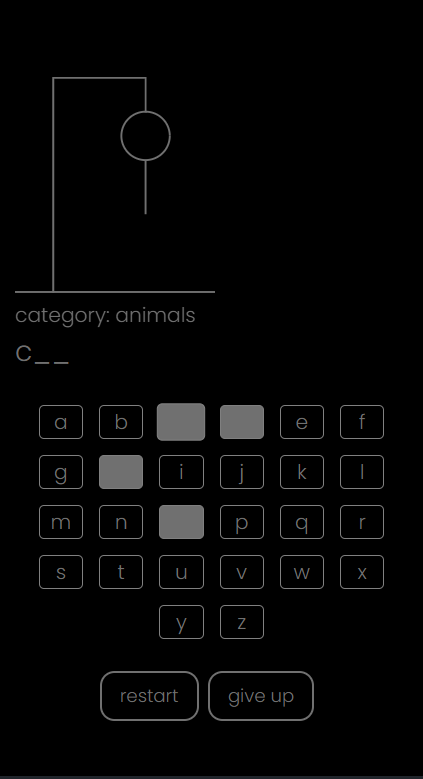
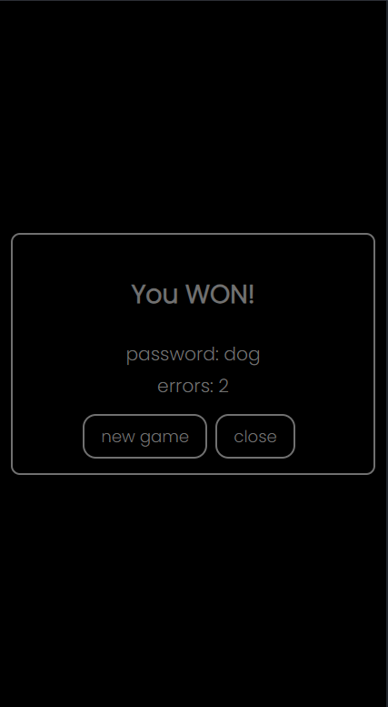
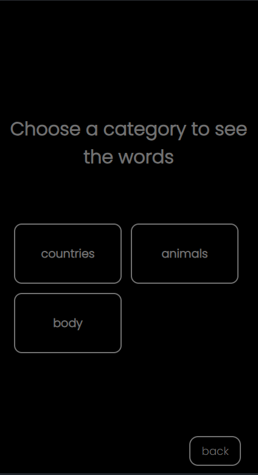
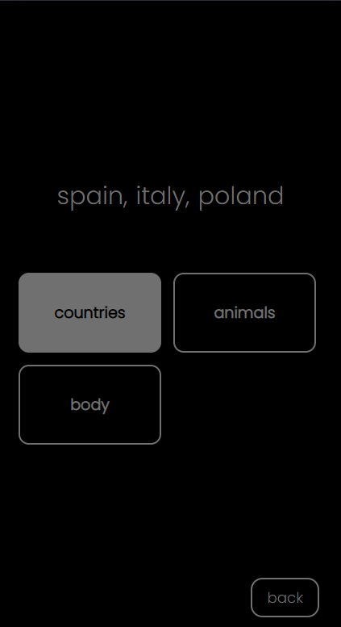

# 🕹️ Hangman Game

A modern implementation of the classic Hangman game built with React, JavaScript, Framer Motion, and Styled Components.
The project focuses on smooth animations, clean UI, and modular architecture — ready for future multiplayer expansion.

### 🚀 Live Demo

[Hangman Game](https://hangman-game-live.netlify.app/)

### 🛠️ Tech Stack

- React
- Framer Motion
- Firebase Firestore
- Styled Components

### 📌 Features

- Classic gameplay — guess the hidden word by selecting letters from an on‑screen keyboard.
- Smooth animations — Framer Motion powers transitions, button interactions, and end‑game screens.
- Responsive UI — layout adapts cleanly across devices, keeping the keyboard and word display readable.
- Mistake tracking — incorrect guesses update the counter with animated feedback.
- Win/Lose screens — animated end‑game modals with a clear restart option.
- Instant restart — full animated reset of the board, keyboard, and counters.
- Clean architecture — logic, UI, and animations separated into dedicated modules.
- Minimalistic design — simple, readable interface focused entirely on gameplay.

### 📅 Planned Features

- More words — expanding the word pool to increase replayability.
- Word categories — adding themed categories (e.g., Animals, Movies, Countries) to make gameplay more structured.
- Player ranking — introducing a simple score system or leaderboard based on wins and mistake count.

### 🖼️ Screenshots

#### New game


#### Win screen


#### Categories


#### Words


#### Mobile

   

### 🛠️ Run Locally

Clone the project

```bash
git clone https://github.com/AlbertKep/hamgman-game
```

Install dependencies

```bash
npm install
```

Start the dev server

```bash
npm run start
```

### 🎯 Learning Goals

- Component architecture — building a clean, modular structure for UI, logic, and animations.
- State management — handling game flow, mistakes, letter states, and restart logic.
- Framer Motion animations — creating smooth transitions, button interactions, and modal effects.
- Responsive UI/UX — designing a layout that scales well across devices.
- Clean JavaScript — writing readable, maintainable JS without TypeScript.
- Game logic design — implementing word reveal mechanics, keyboard behavior, and win/- lose conditions.
